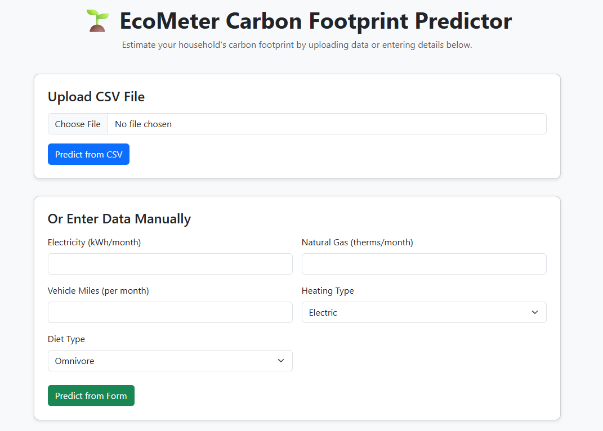

```markdown
# 🌱 EcoMeter: Carbon Footprint Estimator

EcoMeter is an end-to-end machine learning application that estimates household carbon footprint based on lifestyle and energy consumption data.

This project provides:

✅ A machine learning pipeline for training and evaluating regression models  
✅ A Flask web app for predicting carbon footprint via manual input or CSV upload  
✅ Downloadable prediction results  
✅ An advanced UI built with Bootstrap 5  

---

## 📂 Project Structure

```

.
├── src/
│   ├── components/
│   │   ├── data\_ingestion.py
│   │   ├── data\_transformation.py
│   │   └── model\_trainer.py
│   ├── exception.py
│   ├── logger.py
│   ├── pipeline/
│   │   └── predict\_pipeline.py
│   └── utils.py
├── artifacts/          # Saved models and preprocessors
├── static/             # Downloadable prediction files
├── templates/
│   └── index.html      # Web UI template
├── app.py              # Flask application
├── requirements.txt
├── setup.py
└── README.md

````

---

## 🚀 How to Install & Run

1️⃣ **Clone the repository:**

```bash
git clone https://github.com/yourusername/ecometer.git
cd ecometer
````

2️⃣ **Create a virtual environment (recommended):**

```bash
python -m venv venv
source venv/bin/activate   # On Windows: venv\Scripts\activate
```

3️⃣ **Install dependencies:**

```bash
pip install -r requirements.txt
```

4️⃣ **Train the model pipeline:**

Run each component **in order** or set up a script to orchestrate:

```bash
# Ingest data
python src/components/data_ingestion.py

# Transform data
python src/components/data_transformation.py

# Train and save the best model
python src/components/model_trainer.py
```

This creates artifacts:

* `artifacts/train.csv`
* `artifacts/test.csv`
* `artifacts/preprocessor.pkl`
* `artifacts/model.pkl`

5️⃣ **Launch the web app:**

```bash
python app.py
```

Navigate to [http://127.0.0.1:5000](http://127.0.0.1:5000) in your browser.

---

## 🧩 Features

✅ **Train-Test Split and Preprocessing**

* Automatic handling of numeric and categorical features
* Imputation and scaling
* One-hot encoding for categories

✅ **Model Selection and Hyperparameter Tuning**

* Evaluates multiple regression models:

  * Linear Regression, Ridge, Lasso, ElasticNet
  * Decision Tree, Random Forest, Gradient Boosting, AdaBoost
  * SVR, XGBoost, CatBoost
* Selects the best model based on R² score

✅ **Flask Web Interface**

* Upload CSV file for batch predictions
* Enter data manually for single prediction
* Download predictions as CSV
* Modern, responsive UI

---

## 📸 Screenshots



---